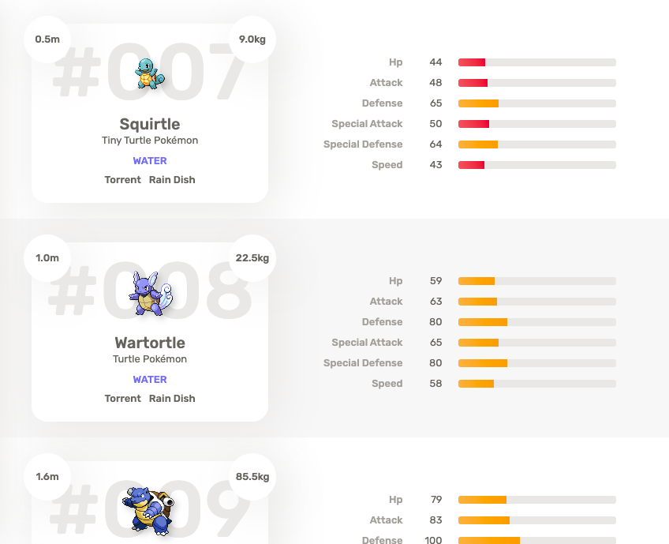

# Frotend - Desafio Veriza

## Desafio

O objetivo deste desafio é avaliar seu domínio em desenvolvimento frontend: sua organização, estilo e boas práticas com código, consultas à APIs, conhecimento de frameworks e tecnologias.

Queremos ver como você aborda a solução de problemas e usa suas habilidades para criar uma solução elegante.

## O problema

Você está prestes a se tornar um mestre Pokemon, mas antes, você foi recrutado para criar uma interface web que possibilite a visualização dos Pokemons do tipo Água. Para isso, desenvolva uma aplicação utilizando a biblioteca React que liste e informe os Pokemons do tipo Água e suas respectivas habilidades.

Consulte as informações na api: https://pokeapi.co

Consulta para pokemons aquáticos: https://pokeapi.co/api/v2/type/water/

O seguinte layout deve ser desenvolvido.

### Seria ótimo ver

- Algum comportamento responsivo implementado.
- Utilização dos padrões a partir do ES6
- Uso de styled components
- Componentização
- Organização de pastas

 

### Plus

Sinta-se à vontade para fazer melhorias no layout, otimizações visuais, etc. 😉
